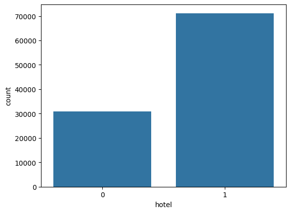
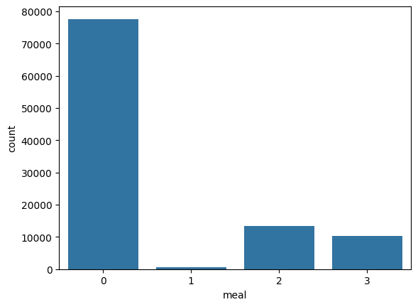
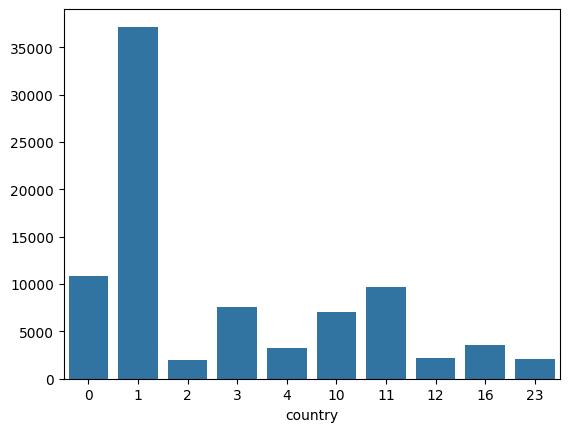
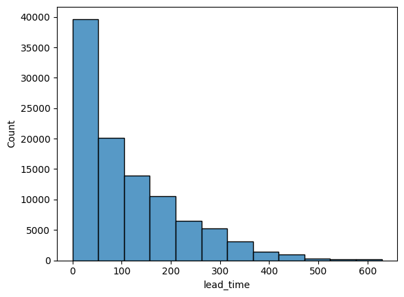
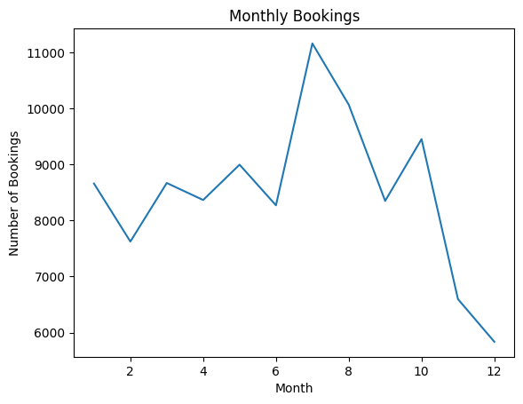
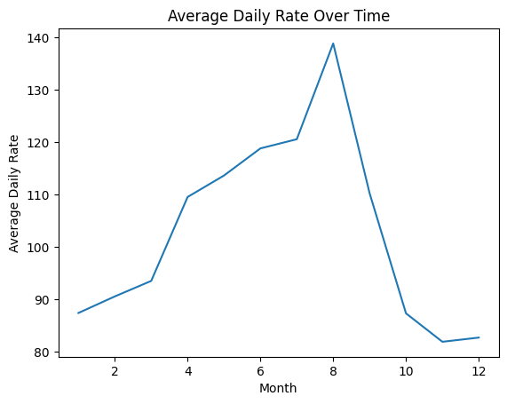
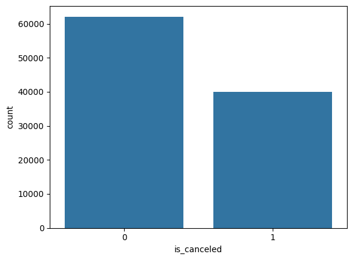
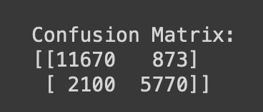
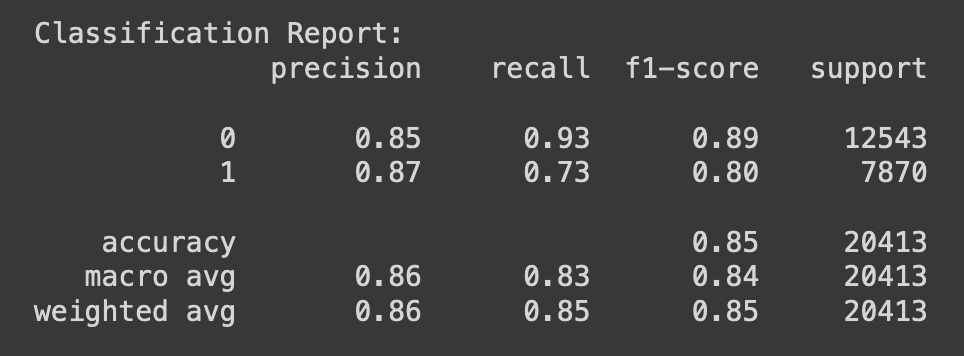
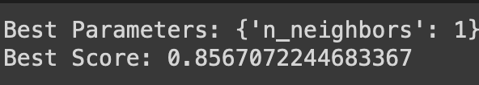

# Hotel Booking Cancellation Prediction

## Project Overview
This project involves data preprocessing and the development of a machine learning model to predict whether a hotel booking will be canceled or not. The dataset used contains information about hotel bookings, and the goal is to create a binary classification model using the K-Nearest Neighbors (KNN) algorithm. The model predicts whether a booking is likely to be canceled (`is_canceled`: 1) or not canceled (`is_canceled`: 0).

### Key Steps:
1. **Data Preprocessing**: Cleaning and transforming the dataset to make it suitable for modeling.
2. **Exploratory Data Analysis (EDA)**: Visualizing key aspects of the data.
3. **Model Development**: Implementing the KNN algorithm for binary classification.
4. **Hyperparameter Tuning**: Optimizing the model by tuning the number of neighbors.

---

## Table of Contents
1. [Dataset](#dataset)
2. [Data Preprocessing](#data-preprocessing)
3. [Exploratory Data Analysis](#exploratory-data-analysis)
4. [Modeling](#modeling)
5. [Evaluation](#evaluation)
6. [Hyperparameter Tuning](#hyperparameter-tuning)
7. [Conclusion](#conclusion)

---

## Dataset
The dataset used in this project is `hotel_bookings.csv`, which contains booking details such as hotel type, lead time, number of guests, and whether the booking was canceled. The target variable is `is_canceled`, which indicates if the booking was canceled (`1`) or not (`0`).

Dataset Link: https://www.kaggle.com/datasets/jessemostipak/hotel-booking-demand
---

## Data Preprocessing
### 1. **Handling Missing Values**:
   - Dropped the `company` column due to a high number of missing values.
   - Removed rows with missing values to ensure a clean dataset.

### 2. **Removing Undefined Meal Data**:
   - Rows with the `Undefined` value in the `meal` column were removed to maintain data integrity.

### 3. **Feature Engineering**:
   - Extracted `year`, `month`, and `day` from the `reservation_status_date` column.
   - Converted categorical features like `hotel`, `meal`, and `customer_type` into numerical representations using mapping techniques.
   - Generated mappings for countries and other categorical data for better model interpretation.

### 4. **Final Dataset**:
   - The cleaned and transformed dataset was exported to `hotel_bookings_cleaned.csv` for future use.

---

## Exploratory Data Analysis
Several visualizations were generated to gain insights into the dataset, including:

1. **Hotel Types**: Distribution of bookings across different hotel types. ('Resort Hotel': 0, 'City Hotel': 1)

2. **Meal Preferences**: Distribution of meal types among customers. ('BB (bed and breakfast)':0, 'FB (full board)':1, 'HB (half board)':2, 'SC (self catering)':3)

3. **Top Countries**: Countries with the most bookings. ('GBR', 0)('PRT', 1)('USA', 2)('ESP', 3)('IRL', 4)('DEU', 10)('FRA', 11)('BEL', 12)('ITA', 16)('BRA', 23)

4. **Lead Time**: Distribution of lead time (days between booking and arrival). (Number of days that elapsed between the entering date of the booking and the arrival date)

5. **Monthly Bookings**: Trends in booking volume over the year.

6. **Average Daily Rate**: Trends in the average daily rate over time. (the measure of the average paid for rooms sold in a given time period)

7. **Cancellation Rates**: The proportion of bookings that were canceled. (Value indicating if the booking was canceled (1) or not (0))

---

## Modeling
### 1. **Train-Test Split**:
   - The dataset was split into 80% training and 20% test data for model evaluation.

### 2. **K-Nearest Neighbors (KNN)**:
   - KNN was used to build the binary classification model.
   - The initial model used `n_neighbors=5`.

### 3. **Model Training**:
   - The KNN model was trained on the training set and evaluated using the test set.

---

## Evaluation
### 1. **Accuracy**: 
   - The model achieved an accuracy of `85%` on the test set.

### 2. **Confusion Matrix**:
   - The confusion matrix was generated to evaluate the number of true positives, true negatives, false positives, and false negatives.

### 3. **Classification Report**:
   - Precision, recall, and F1-score were reported for both classes (canceled and not canceled).

---

## Hyperparameter Tuning
Grid search was used to find the optimal value for `n_neighbors`:

- Tested values: `[1, 3, 5]`.
- The best value for `n_neighbors` was found to be `1`, with a score of `86%`.

---

## Conclusion
This project successfully demonstrates the steps involved in cleaning, exploring, and modeling a hotel booking dataset to predict cancellations. By leveraging the KNN algorithm and tuning its parameters, the model was able to provide reasonable accuracy in predicting whether a booking would be canceled.

---

## Requirements
To run this project, the following Python libraries are required:
- pandas
- numpy
- matplotlib
- seaborn
- scikit-learn

---

## Usage
1. Import the necessary libraries and load the dataset.
2. Perform data preprocessing by cleaning null values and converting categorical data to numerical form.
3. Visualize key features and relationships using various plots.
4. Train the KNN model using the preprocessed dataset.
5. Evaluate the model’s performance on the test set.
6. Fine-tune the model using grid search for optimal performance.
